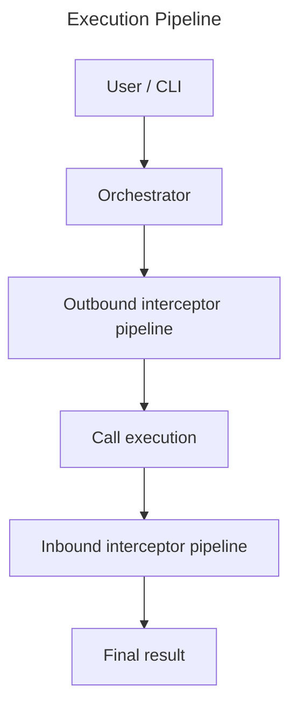

# OrcRPC

Json RPC Orchestrated Interception

- [Protocol](docs/protocol.md)
- [Canonical Actions](docs/canonical_actions.md)
- [Examples](docs/examples.md)

## Architecture Overview

## License

This project is licensed under either of

- Apache License, Version 2.0 ([LICENSE-APACHE](LICENSE-APACHE) or https://www.apache.org/licenses/LICENSE-2.0)
- MIT license ([LICENSE-MIT](LICENSE-MIT) or https://opensource.org/licenses/MIT)

at your option.

### Contribution

Unless you explicitly state otherwise, any contribution intentionally submitted for inclusion in the work by you, as defined in the Apache-2.0 license, shall be dual licensed as above, without any additional terms or conditions.
